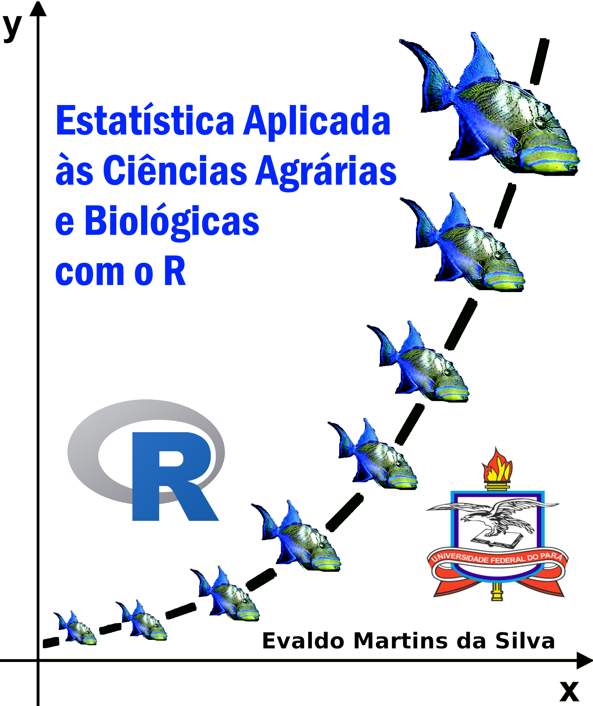

<!-- README.md is generated from README.Rmd. Please edit that file -->

```{r, include = FALSE}
knitr::opts_chunk$set(
  collapse = TRUE,
  comment = "#>",
  fig.path = "man/figures/README-",
  out.width = "40%"
)
```

# laquipedados

<!-- badges: start -->

<!-- badges: end -->

O objetivo deste repositório é servir de base para o livro ***Estatística Aplicada às Ciências Agrárias e Biológicas em R***.

```{r cars, echo=FALSE}

```

## Exemplo de carregamento de dados

Você pode carregar os conjunto de daos deste pacote com os comandos abaixo:

```{r exemple, warning= FALSE, message = FALSE}
library(readr)
url = "https://raw.githubusercontent.com/Evaldo-Martins-STAT/laquipedados/master/caranguejo.csv"
dados <- read_csv(url)

```

-   Exibição dos dados de sua análise

    ```{r dados}
    head(dados)
    ```
